# Projeto Final do Módulo 3 do Curso de Desenvolvimento WEB Full-Stack da Resilia Educação - NBAPP :computer::basketball:

## Descrição
A proposta do projeto era utilizar uma das bases de dados disponibilizadas (escolhemos a da NBA) e executar uma série de queries percebidas como relevantes. Utilizamos a seguinte orientação:

 
 

1. Limpeza e reestruturaçda Base de dados
2. Modelagem / Criação das tabelas
3. População das Tabelas
4. Criação e execução das Queries

## Softwares & tecnologias utilizadas projeto :computer:

- [x] Back-end
    - [x] Ecxel
    - [x] SQL
    - [x] MySQL Server / Workbench
    - [x] DBeaver
- [x] Front-end
    - [x] HTML5
    - [x] CSS3
    - [x] Figma
    - [x] Bootstrap
- [x] Versionamento de Código
    - [x] GitHub
    - [x] VS Code
- [x] Apresentação
    - [x] Canva
    - [x] Paint Tool Sai

## Organização do projeto:

- [x] Kanban
- [x] Divisão em Front-end para apresentação e Back-end para requisitos técnicos

## Queries criadas:

Query para classificacao geral por conferencia leste e oeste
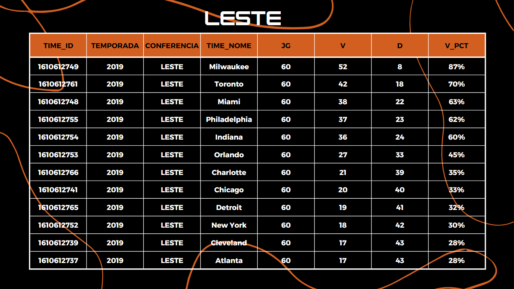
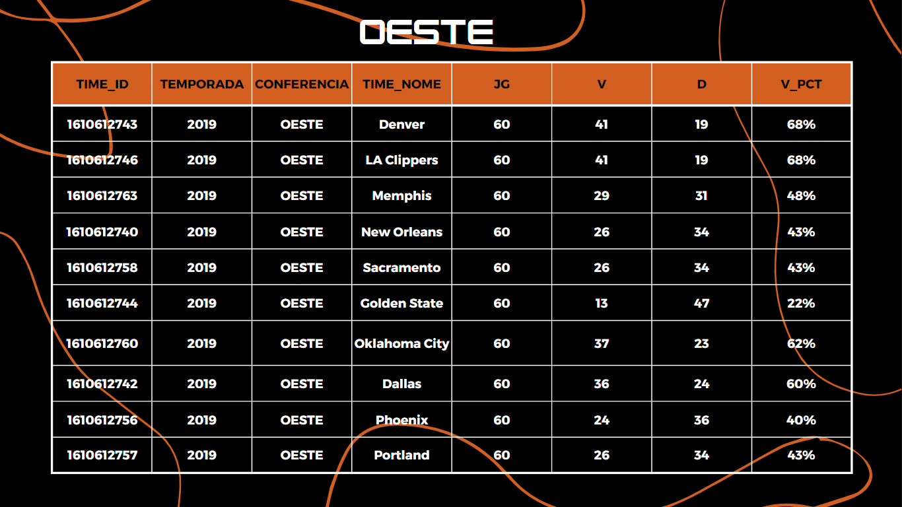

Query top 5 jogos destaques da temporada (por quantidade de pontos marcados em casa)
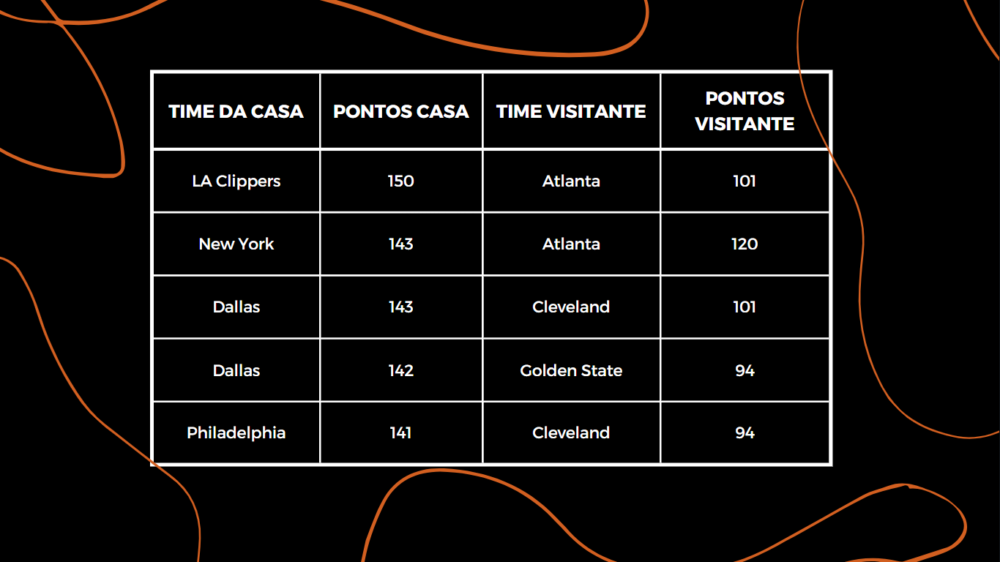

Query top 10 players com mais assistências
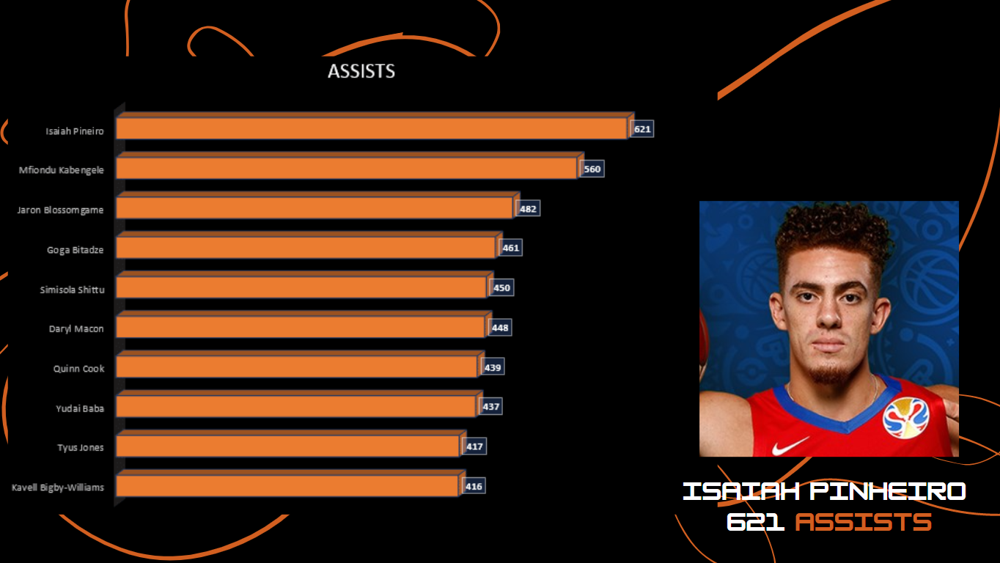

Query top 10 players com mais bloqueios (tocos)
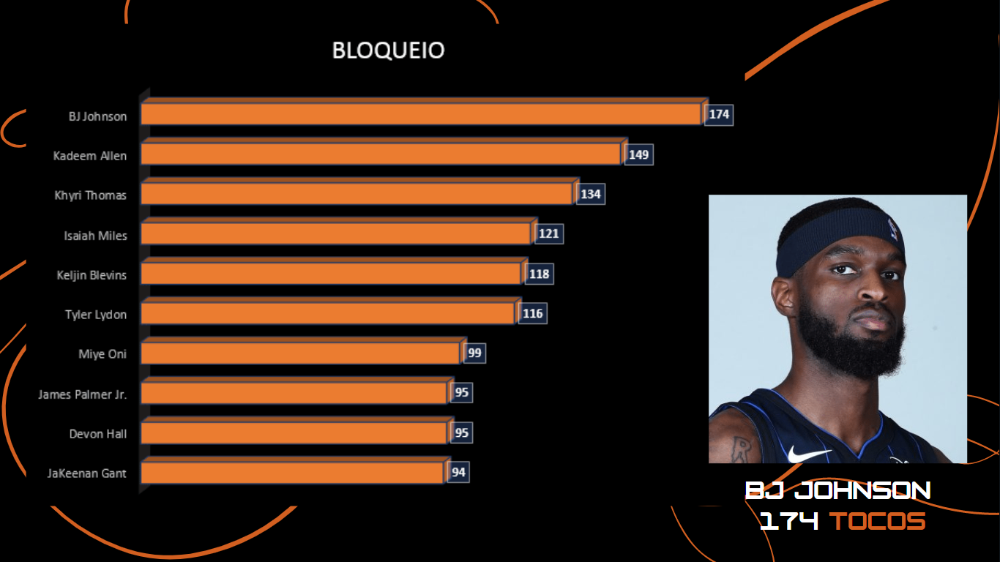

Query top 10 players com mais pontos
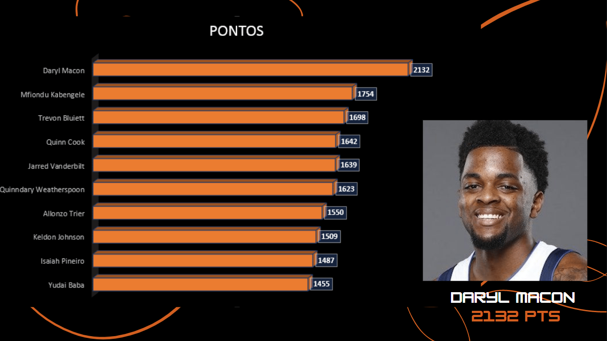

Query top 10 players com mais rebotes
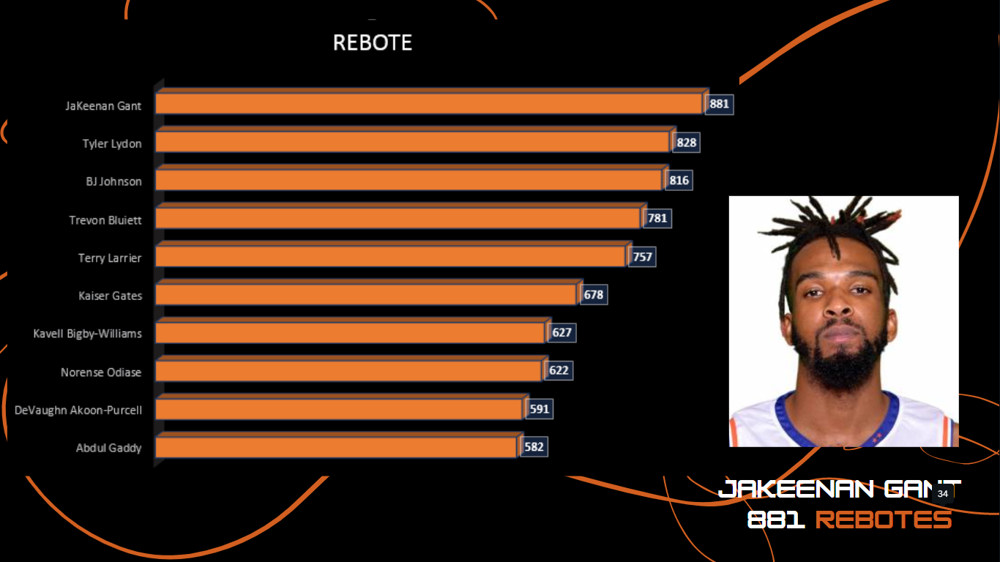

Query top 10 players com mais roubadas de bola
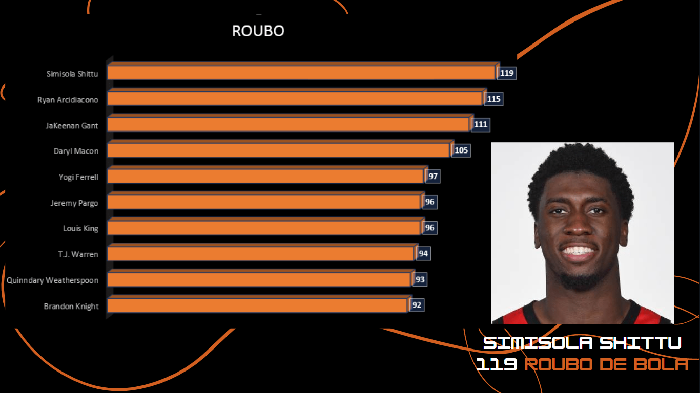

Query top 10 times com mais assistências
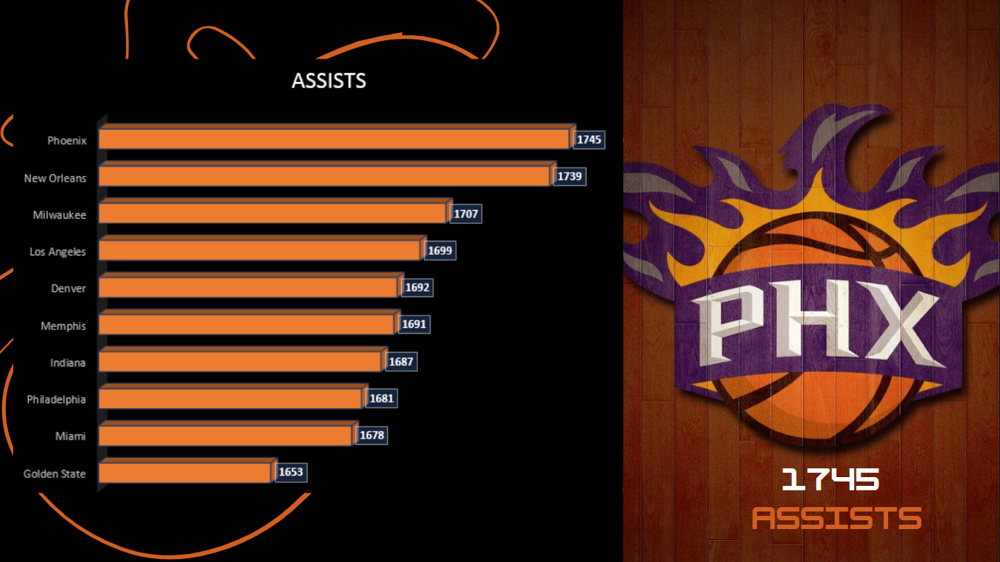

Query top 10 times com mais bloqueios (tocos)
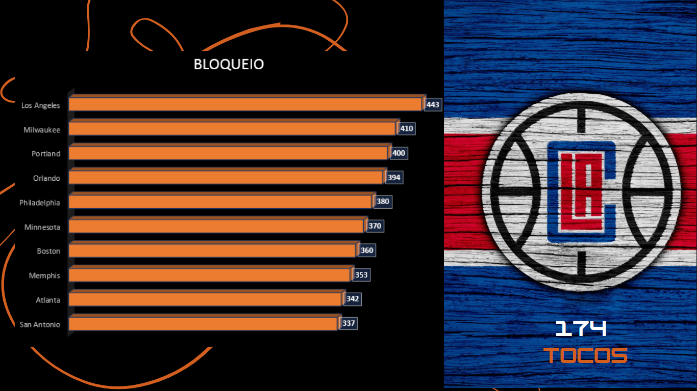

Query top 10 times com mais pontos
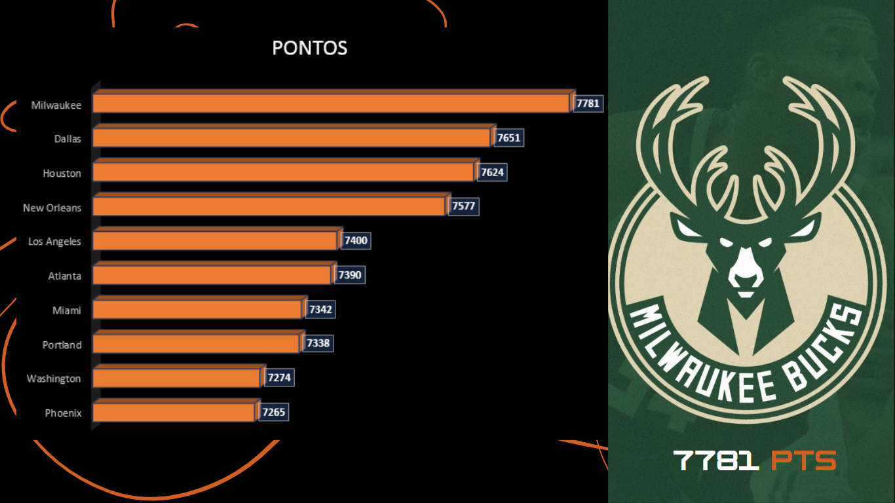

Query top 10 times com mais rebotes
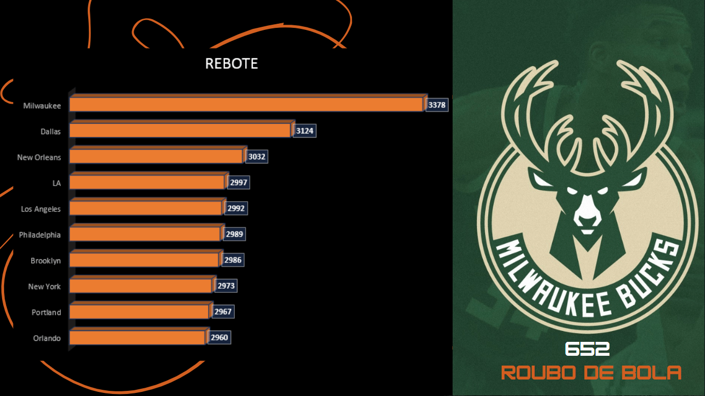

Query top 10 times com mais roubadas de bola
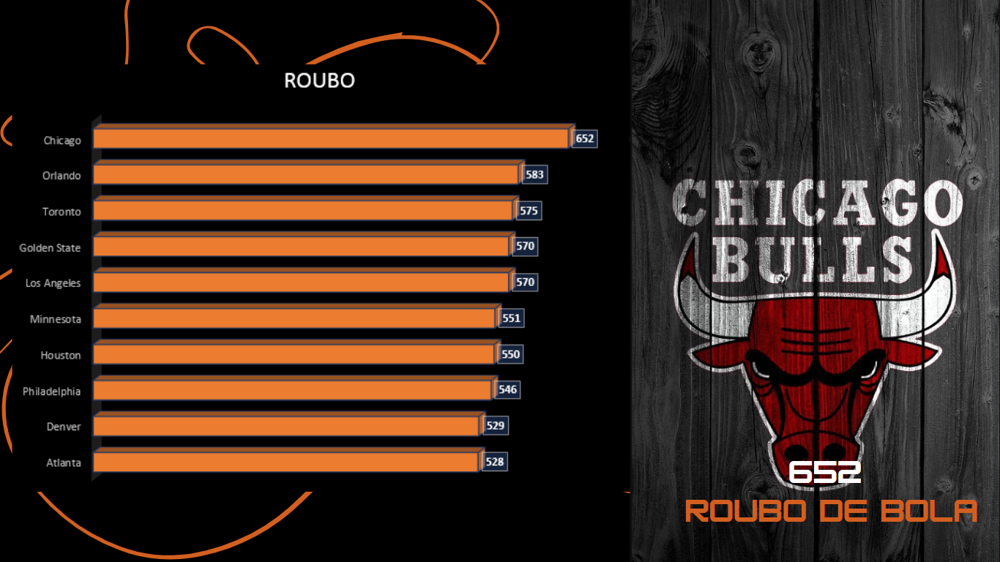

