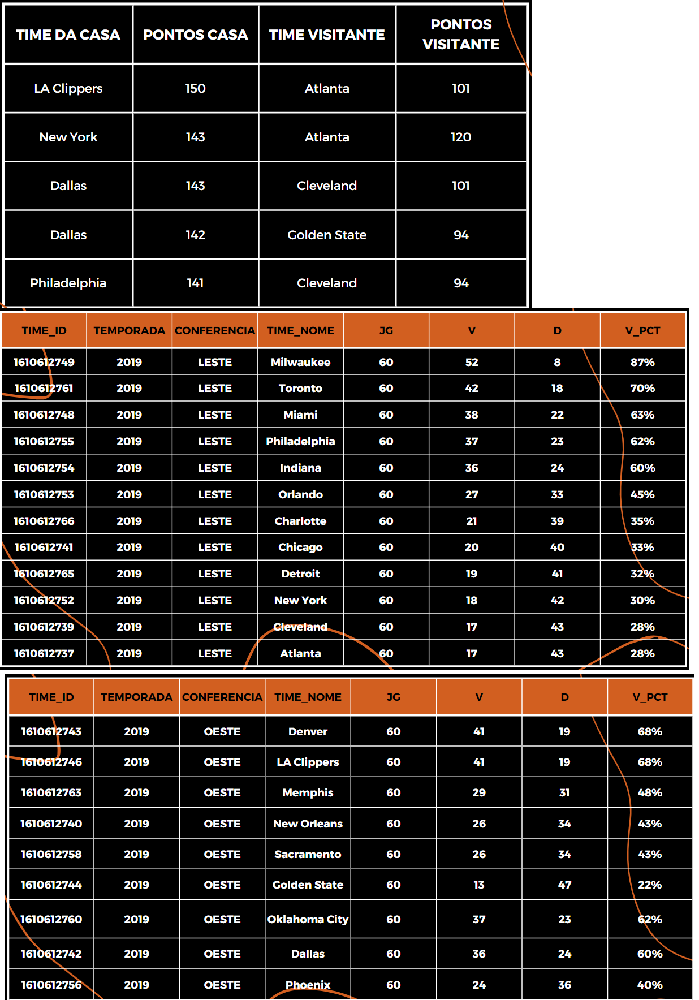
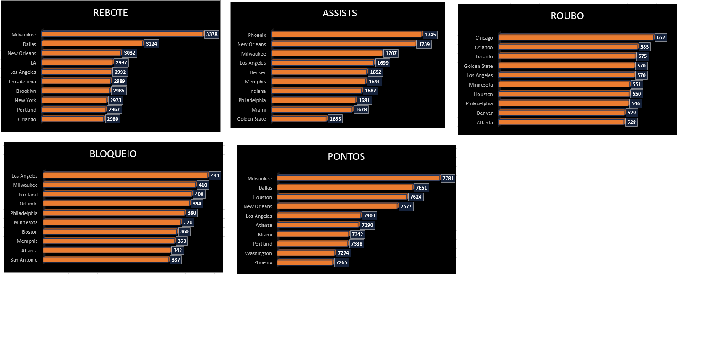
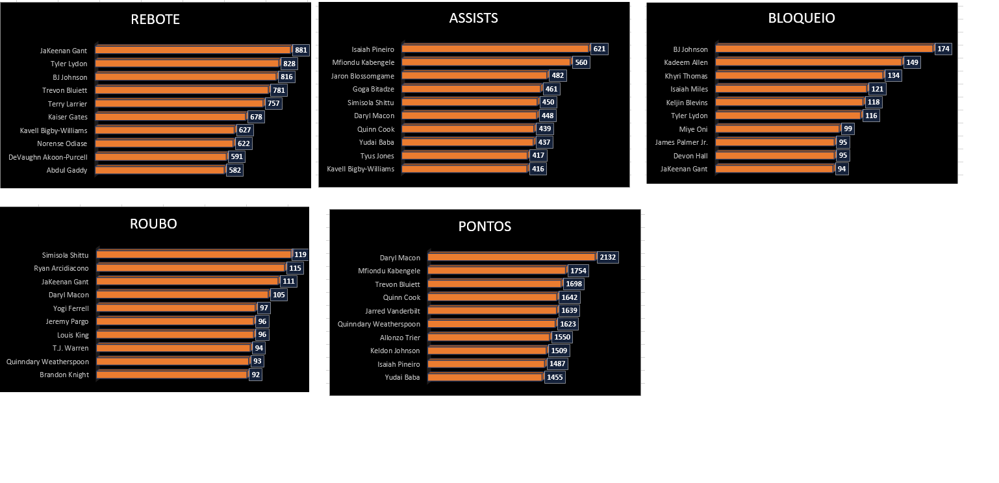

# Projeto Final do Módulo 3 do Curso de Desenvolvimento WEB Full-Stack da Resilia Educação - NBAPP :computer::basketball:

## Descrição
A proposta do projeto era utilizar uma das bases de dados disponibilizadas (escolhemos a da NBA) e executar uma série de queries percebidas como relevantes. Utilizamos a seguinte orientação:

 
 

1. Limpeza e reestruturaçda Base de dados
2. Modelagem / Criação das tabelas
3. População das Tabelas
4. Criação e execução das Queries

## Softwares & tecnologias utilizadas projeto :computer:

- [x] Back-end
    - [x] Ecxel
    - [x] SQL
    - [x] MySQL Server / Workbench
    - [x] DBeaver
- [x] Front-end
    - [x] HTML5
    - [x] CSS3
    - [x] Figma
    - [x] Bootstrap
- [x] Outras
    - [x] GitHub
    - [x] VS Code

## Organização do projeto:

- [x] Kanban
- [x] Divisão em Front-end (para apresentação) e Back-end para requisitos técnicos

## QUERIES CRIADAS:

